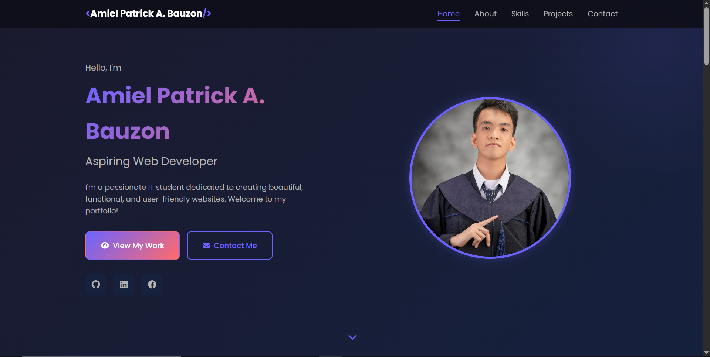

# Personal Portfolio Website

A responsive personal portfolio website showcasing my skills, projects, and contact information.

## 🌐 Live Demo

[View Live Site](https://yourusername.github.io/portfolio)

## 📸 Screenshot

## 🛠️ Tech Stack

- **HTML5** - Semantic markup and structure
- **CSS3** - Custom styling with Flexbox & Grid
- **JavaScript** - Interactive functionality
- **Font Awesome** - Icons
- **Google Fonts** - Typography (Poppins)

## ✨ Features

- ✅ Fully responsive design (Mobile, Tablet, Desktop)
- ✅ Semantic HTML5 structure
- ✅ CSS Variables for theming
- ✅ Flexbox and CSS Grid layouts
- ✅ Mobile hamburger navigation
- ✅ Smooth scroll navigation
- ✅ Animated skill progress bars
- ✅ Project gallery with hover effects
- ✅ Contact form (Formspree integration)
- ✅ Social media links

## 📁 Project Structure